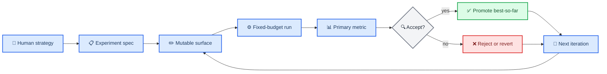

# Autoresearch compatibility

_Research-backed mapping from Karpathy-style autoresearch loops to the generalized Hermes Lab model, refreshed on 2026-03-21_

---

## 🧪 What autoresearch actually is

Karpathy's upstream `autoresearch` is a tightly constrained autonomous experiment loop: the human edits `program.md`, the agent edits one mutable file (`train.py`), runs a fixed five-minute experiment, reads one primary metric (`val_bpb`), logs the result to `results.tsv`, and keeps or discards the change by advancing or resetting the branch.[^1][^2]

That constraint set matters more than the specific training domain. The important invariants are: one clearly bounded mutable surface, one trusted evaluator, one fixed time budget, one primary metric, and one explicit keep-or-revert decision rule.[^1][^2]

## 🔁 What the ports prove

The MLX port keeps the same loop semantics while swapping out the platform: one mutable `train.py`, one fixed-budget run, one metric, and keep-or-revert via git, but now on Apple Silicon through MLX instead of PyTorch/CUDA.[^3]

The macOS fork makes the same point from a different angle: the core loop stays intact while the runtime adapts for MPS, CPU, and FlashAttention fallbacks. In other words, the execution substrate can change without changing the autoresearch pattern itself.[^4]

Ralph adds the cold-start lesson that matters most for this lab: each iteration starts fresh, reads the same on-disk state, and treats files as memory instead of depending on hidden conversational context.[^5]

## 🗺️ How Hermes Lab generalizes autoresearch

Hermes Lab now treats Karpathy's loop as a domain-agnostic experiment contract instead of a GPU-training special case.

| Autoresearch concept | Upstream form | Hermes Lab generalization |
| --- | --- | --- |
| Human strategy | `program.md` | `PROGRAM.md` |
| Mutable surface | one `train.py` | `mutable_paths` list in `SPEC.yaml` |
| Read-only evaluator context | `prepare.py` | `read_only_paths` list plus `validation_command` |
| Fixed run budget | always 5 minutes | `time_budget_minutes` |
| Primary metric | `val_bpb` | `metric` + `metric_direction` |
| Keep or discard rule | git advance or reset | `acceptance_rule` + best-run pointers + executor-managed workspace policy |
| Results ledger | `results.tsv` | immutable run bundles + `metrics.jsonl` + event ledger |
| Fresh-agent continuation | small repo + `program.md` | `README-FIRST.md`, `LAB-STATUS.md`, `RUNBOOK.md`, `SUMMARY.md`, `NEXT.md` |

This means the lab can host literature review loops, benchmark tuning loops, model-selection loops, scraper quality loops, data-analysis loops, or code-optimization loops, as long as the problem can be expressed as: mutate a bounded surface, run a bounded trial, record one primary metric, and decide what gets promoted.

## ✅ What now exists in this repo

The repo root now exposes a generic harness contract through `AGENTS.md` and `LAB_MANIFEST.json`. A new agent can read the repo, discover the control commands, learn the data-root contract, and see the executor environment keys without reverse-engineering the Python runtime.

Each experiment now carries a `RUNBOOK.md` that explains ingress files, mutable surfaces, read-only surfaces, commands, required egress files, and expected artifacts. That makes per-experiment execution legible even when the underlying problem domain changes.

The generic template `templates/autoresearch-generic.yaml` adds the fields needed to describe non-LLM problems cleanly:

- `workspace_root`
- `setup_command`
- `baseline_command`
- `executor_command`
- `mutation_command`
- `validation_command`
- `acceptance_rule`
- `promotion_strategy`
- `workspace_mode`
- `require_clean_workspace`
- `mutable_paths`
- `read_only_paths`
- `ingress_files`
- `egress_files`
- `artifacts_expected`

The scheduler now passes those fields into the executor environment and maintains checkpoint pointers for the latest and best run, so external harnesses can integrate without relying on implicit conventions.

The repo now also ships a concrete adapter, `scripts/reference_executor.py`, plus a git-oriented template in `templates/code-autoresearch.yaml`. That closes the gap between "general contract" and "usable keep-or-revert loop" for code tasks.

## 📋 What an agent harness should do

Point the harness at the repo root first, not directly at an experiment folder.

1. Read `AGENTS.md` and `LAB_MANIFEST.json`.
2. Initialize or locate the data root.
3. Read `README-FIRST.md`, `LAB-STATUS.md`, and `PROGRAM.md`.
4. Select the target experiment.
5. Read `RUNBOOK.md`, `SUMMARY.md`, `NEXT.md`, and `SPEC.yaml`.
6. Acquire a lease before writing.
7. Execute only inside the claimed run bundle.
8. Write `RESULT.md`, `metrics.json`, and artifacts.
9. Let the reducer rebuild projections.

That sequence is the file-based equivalent of pointing an agent at upstream `program.md` and saying "start the loop," but generalized so the mutable surface, metric, validator, and workspace can differ by experiment.

## 🚧 Remaining limits

This repo now supports generalized autoresearch as an orchestration contract, not as a universal domain-specific executor. A harness still has to know how to act inside its own workspace and how to compute its own metric if the built-in stub is replaced.

The keep-or-revert decision is also generalized rather than hard-coded to git reset. That is deliberate. For some domains, the right promotion action is "update best artifact," for others it is "keep the branch tip," and for others it is "promote the best checkpoint but discard the code diff." The lab now has a place to express that rule explicitly per experiment instead of assuming one global policy.

## Footnotes

[^1]: Karpathy, A. (2026). "autoresearch." GitHub README. https://github.com/karpathy/autoresearch

[^2]: Karpathy, A. (2026). "program.md" in `karpathy/autoresearch`. GitHub. https://raw.githubusercontent.com/karpathy/autoresearch/master/program.md

[^3]: trevin-creator. (2026). "autoresearch-mlx" README. GitHub. https://raw.githubusercontent.com/trevin-creator/autoresearch-mlx/main/README.md

[^4]: miolini. (2026). "autoresearch-macos" README. GitHub. https://raw.githubusercontent.com/miolini/autoresearch-macos/master/README.md

[^5]: Nuttall, I. (2026). "Ralph" README. GitHub. https://raw.githubusercontent.com/iannuttall/ralph/main/README.md
